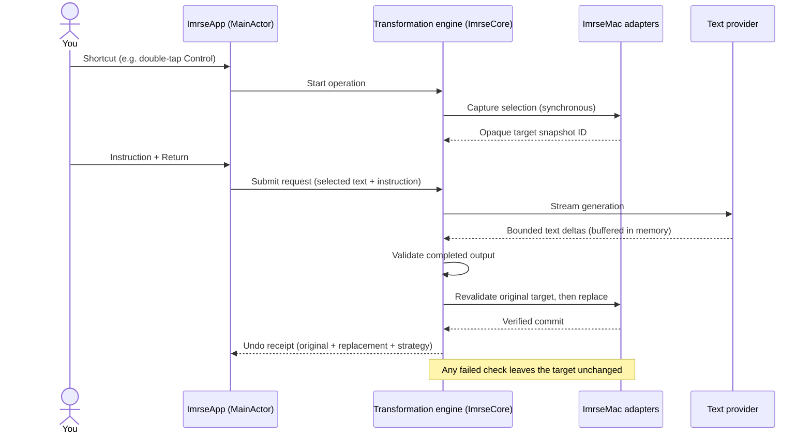
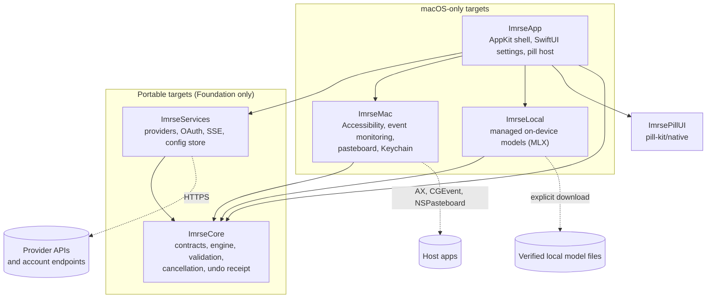
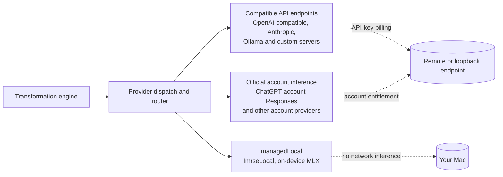

<p align="center">
  
</p>

<h1 align="center">imrse</h1>

<p align="center"><strong>Your AI commands, everywhere you type.</strong></p>

<p align="center">A native macOS menu-bar app that rewrites selected text in place with a model you choose—and leaves targets it cannot safely verify unchanged.</p>

<p align="center">
  <a href="https://developer.apple.com/macos/"></a>
  <a href="Package.swift"></a>
  <a href=".github/workflows/verify.yml"></a>
  <a href="LICENSE"></a>
</p>

<p align="center">
  <a href="#how-it-works">How it works</a> ·
  <a href="#availability">Availability</a> ·
  <a href="#build-and-launch-from-source">Build</a> ·
  <a href="#first-run">First run</a> ·
  <a href="#architecture">Architecture</a> ·
  <a href="#models-and-provider-billing">Models</a> ·
  <a href="#privacy-and-safety">Privacy</a> ·
  <a href="#engineering-and-license">Engineering &amp; license</a>
</p>

---

Select text in a supported app, trigger imrse with a shortcut, type an instruction such as “make this concise,” and press **Return**. imrse sends the selection and your instruction to the model you configured, then replaces the selection with the finished result. If the target changed, became unreadable, or cannot be verified, imrse leaves it alone instead of guessing.

| | |
| --- | --- |
| **Status** | Pre-release. Build from source; no published release yet (see [Availability](#availability)) |
| **Runtime** | macOS 14 or later; managed on-device models need Apple silicon |
| **Build** | Swift 6.2 or later with SwiftBuild support; pinned Xcode 26.6 for the packaged Metal resources |
| **Stack** | Swift, AppKit and SwiftUI, macOS Accessibility, MLX Swift LM for on-device inference |
| **Models** | Your choice: on-device, Ollama or any compatible local server, API keys, or supported account sign-in |
| **Data** | No account, no inference backend, no telemetry, no transformation history. Settings and presets live in `~/Library/Application Support/imrse`; secrets live in Keychain |
| **License** | [MIT](LICENSE) |

## How it works

1. **Capture.** Your shortcut fires. imrse immediately snapshots which text field and selection you are acting on. That target is fixed for the whole operation; the UI cannot swap it for a different one later.
2. **Instruct.** A small input pill appears. You type an instruction, or press **Return** on an empty field to use your `default.md` instruction (or the built-in default).
3. **Generate.** The selected text and your instruction, not the surrounding document, go to the selected provider. Streamed text is buffered in memory. Partial output is never typed into your app.
4. **Verify, then replace.** When generation completes, imrse validates the output and re-checks that the original target is still there and unchanged. Only then does it write the replacement.
5. **Undo.** A successful replacement leaves a one-step undo that is valid only while the target is still unchanged. Press **Escape** at any time before completion to cancel.



## Features

- **Verified in-place replacement.** Replaces only targets it can still verify. Secure, read-only, unsupported, or changed selections are left untouched.
- **Bring your own model.** On-device Qwen3, Ollama and other OpenAI-compatible local servers, API keys for ten providers, and account sign-in for ChatGPT, OpenRouter, Hugging Face and GitHub Copilot. See [Models and provider billing](#models-and-provider-billing).
- **Local-only mode.** Allows managed on-device models and loopback endpoints and blocks remote fallback.
- **Presets.** Named transformations stored as portable Markdown files (`presets/*.md`). **Command-1** through **Command-9** fill a configured preset while the imrse input is active.
- **One-step undo.** Restore the original from the menu-bar icon while the target is unchanged. The original and latest replacement are kept in volatile memory and cleared on quit.
- **Native shell.** Template menu-bar icon, one retained 900 × 570 Settings window with six sidebar destinations, and a Dock-visible fallback if you hide the menu-bar icon so Settings is never stranded.
- **Private by construction.** Credentials never touch configuration files. There is no content history, queue, background job service, or telemetry.

## Availability

There are currently no Git tags, published releases, or public prebuilt app assets, so there is no official download URL. An ARM64 beta/preview is being prepared locally in a separate packaging workstream; no public release is authorized by these docs. Its working candidate identifier is `v0.2.0-beta.1`, with planned numeric app metadata `0.2.0`, build `12`. Current `main` remains at version `0.1.2`, build `11`, and this documentation does not change it.

The preview will be ad-hoc signed and unnotarized. No Apple Developer account or Developer ID publisher identity is available, and Developer ID signing/notarization are not being pursued for this preview; that does not prevent local preparation. Gatekeeper may block a downloaded app. This is not a stable, Apple-certified, notarized, or auto-updating distribution, and its ad-hoc signature does not identify a trusted publisher. Until an actual asset is prepared and its public release is separately approved, build from source using the instructions below.

See the [release readiness notes](docs/release-readiness.md) and [release-notes candidate](docs/release-notes-candidate.md) for the current release assessment.

## Build and launch from source

**App runtime:** macOS 14 or later. **Build toolchain:** Swift 6.2 or later with SwiftBuild support. The package's `swift-tools-version: 6.0` declaration is not the supported toolchain version for the current app build. The packaged app's Metal resources are verified with the repository's pinned Xcode 26.6 and its Metal toolchain; native test CI separately pins Xcode 26.3.

On a Mac with the required Xcode and Metal toolchain selected, run these commands from a terminal:

```sh
git clone https://github.com/exterminatorrat/imrse.git
cd imrse
swift test --jobs 1 -Xswiftc -warnings-as-errors
./scripts/build-app.sh
open dist/imrse.app
```

The build script uses SwiftBuild, assembles the app resources, verifies the bundle, and writes `dist/imrse.app`. It uses the ad-hoc identity (`-`) by default, or an existing identity supplied through `SIGNING_IDENTITY`; it does not notarize the app.

**Updating and rollback are manual.** The inspected source has no automatic updater. Before rebuilding over an existing `dist/imrse.app`, make a separate Finder copy elsewhere if you want to keep that older bundle. To install the new app, use Finder to copy it to `~/Applications` or `/Applications`; back up an existing `imrse.app` before replacing it, and launch only the copy you intend to use. Keep the previous bundle until the new one works. Do not delete `~/Library/Application Support/imrse` or imrse's Keychain items to troubleshoot an update.

## First run

1. Click the imrse menu-bar icon to open Settings, then go to **Models → Add Provider**. Choose an available provider or model, complete any explicit local-model download or account setup, then choose your default model.
2. Allow **Input Monitoring** for the global shortcut and **Accessibility** for reading and replacing the selected text. macOS manages these separately in **System Settings → Privacy & Security**. Code signing does not grant either permission, and a Keychain prompt is not a grant.
3. For a safe first try, create a disposable TextEdit document and choose **Format → Make Plain Text**. Select a short paragraph, double-tap **Control**, enter an instruction such as “Make this concise,” and press **Return**. An empty instruction uses your `default.md` instruction or the built-in default.
4. Wait for the completed replacement. Right-click or Control-click the imrse menu-bar icon and choose **Undo** while the target is unchanged to restore the original. Press **Escape** before completion to cancel.

imrse only replaces a target it can still verify. An unsupported, secure, read-only, or changed selection is left unchanged rather than pasted into a guessed field. The completed TextEdit plain-text probe does not establish compatibility with every app or rich-text editor.

Re-signing an ad-hoc build or changing `SIGNING_IDENTITY` can cause macOS to ask again for access to the login Keychain. Reusing a stable `SIGNING_IDENTITY` may preserve the code identity Keychain recognizes across builds, but it preserves the signer identity—not the executable contents—and cannot guarantee byte-identical builds or that every prompt will disappear. Keychain access is separate from Accessibility and Input Monitoring: signing the app or responding to a Keychain prompt grants neither privacy permission. Review the app and prompt locally; never share your login-Keychain password, API key, or token, and do not delete Keychain items to troubleshoot.

## Architecture

imrse is split into small Swift targets with a strict dependency direction. The decision logic lives in a portable core that knows nothing about macOS; everything platform-specific sits behind narrow adapter contracts. That keeps the safety-critical logic testable with deterministic doubles, and it keeps uncertain native behavior isolated.



| Target | Responsibility |
| --- | --- |
| `ImrseCore` | Imports only Foundation. Owns contracts, transformation state, output validation, cancellation, shortcut recognition, diagnostics, and the latest undo receipt. |
| `ImrseServices` | HTTP providers, provider routing and dispatch, OAuth account sessions, incremental SSE parsing, and user-owned configuration files. Portable paths use Core and Foundation (FoundationNetworking on Linux). OAuth signature and PKCE verification uses macOS Security/CryptoKit when available and fails closed otherwise. |
| `ImrseMac` | Adapts macOS Accessibility, CoreGraphics event monitoring, `NSPasteboard`, and Keychain to the portable contracts. |
| `ImrseLocal` | Managed on-device models. On Apple silicon it uses pinned MLX Swift LM dependencies, verified local artifacts, and bounded native inference; other Mac architectures report an unsupported runtime status. An actor-owned library handles explicit downloads, staging, integrity checks, installation, and removal. Local loading never invokes a Hub downloader. |
| `ImrseApp` | Presentation, native panel behavior, Settings, and application lifetime. AppKit owns the app lifetime, the template status item, and the retained Settings window; SwiftUI owns the sidebar destinations, provider and diagnostics sheets, and in-memory preset drafts. |
| `pill-kit/native` | The supplied local Swift package. `ImrsePillCore` owns presentation IDs and status rhythm; `ImrsePillUI` renders the approved SwiftUI components and original Lottie resources. It never replaces the host transformation engine; the app maps real engine events into its presentation lifecycle. |
| `pill-kit/web` | A separate React preview used as the visual source of truth. Its simulated callbacks never enter the app target. |
| `settings-kit` | The supplied settings source and reference screenshot, preserved as design provenance. The app adapts that presentation to its real `AppModel`, provider and preset identities, and services. |

Native targets are excluded from the Linux package graph; they are not replaced with simulated native implementations.

### Provider dispatch

The engine talks to one `TextProvider` contract. Behind it, dispatch separates three provider families so billing and privacy behavior can never blur.



Rules that fall out of this split:

- **Local-only** permits native inference and loopback endpoints and never falls back to a remote provider.
- A **ChatGPT-account** primary never silently falls back to remote API-key billing.
- Account models are filtered against what the account can actually use.
- Only the **completed final output** is released for host validation, not reasoning or commentary text, and not output cut off by token-budget exhaustion.

### Design invariants

| Invariant | What it means in practice |
| --- | --- |
| Fail closed | An unverifiable, stale, or changed target is never written to. Undo revalidates the replacement, the application, and the target, and refuses when stale. |
| Fixed target | The target is an opaque snapshot ID in Core, captured synchronously before any UI callback. The real AX element and platform verification details stay in the native registry. |
| No partial writes | Deltas are accumulated in memory. The app never types a partial response into a host. |
| Cancellation wins | Cancelling invalidates the active operation before captured content is released, so a late response cannot commit. |
| Atomic commit phase | A write is never interrupted halfway, and a second operation cannot start before the first adapter settles. |
| Minimal receipt | An undo receipt holds only the original selection, the completed replacement, and the strategy. No host document is retained. |
| Credentials stay in Keychain | API keys are stored under stable provider IDs and OAuth sessions under reserved `oauth:<providerID>` keys. Configuration and preset files never contain credentials. |

### Concurrency model

Selection and presentation are `MainActor`-isolated, because macOS responder and Accessibility handles belong to a single adapter owner. Providers and credential stores are `Sendable`. Generation runs as an owned, cancellable task, never as detached work.

### Test seams

`SelectionAccess`, `TextProvider`, and `CredentialStore` each have deterministic test doubles. Services take an injectable transport and an incremental SSE parser. Native uncertainty stays behind adapters. A browser harness can test visual intent, but it is not evidence of `NSPanel` focus or Accessibility interoperability.

### Repository layout

| Path | Contents |
| --- | --- |
| `Sources/` | `ImrseCore`, `ImrseServices`, `ImrseMac`, `ImrseLocal`, `ImrseApp` |
| `Tests/` | Test targets for Core, Services, Mac, Local, and App |
| `Resources/` | App icon and bundled resources |
| `scripts/` | Build and packaging scripts, including `build-app.sh` |
| `pill-kit/` | Supplied pill UI: native Swift package and React preview |
| `settings-kit/` | Supplied Settings design source and reference screenshot |
| `design-harness/` | Pointer to the React preview and its checks (the standalone HTML preview is retired) |
| `docs/` | Provider setup, release readiness, and roadmap documents |

## Models and provider billing

### On-device models

Managed models run locally on **Apple silicon only**. Downloads are explicit and verified: Qwen3 1.7B (about 984 MB) and Qwen3 4B Instruct (about 2.28 GB). The app does not silently send local-model requests to a cloud provider.

### Account and API-key providers

Select **Settings → Models → Add Provider** to configure a connection. For the exact endpoints, OAuth setup, and model-ID requirements, see [Official provider connections](docs/official-provider-connections.md).

| Route | Providers | Billing and prerequisites |
| --- | --- | --- |
| API key | OpenAI, OpenRouter, Anthropic/Claude, DeepSeek, Google Gemini, Grok (xAI), Mistral, Together AI, Fireworks, Cerebras | Each provider's API quota and billing, not a consumer chat plan. Use an exact text-generation model ID your account can access. Grok is the xAI route; it is not Groq. |
| ChatGPT account | ChatGPT | Requires an eligible plan-use entitlement and a model available to that account. Signing in alone does not prove inference access, and a failed account request does not switch to API-key billing. |
| OpenRouter account | OpenRouter | Uses OpenRouter credits/API billing, not a ChatGPT, Claude, or Google consumer subscription. |
| Hugging Face account | Hugging Face | Uses Inference Providers and available compute credits or paid usage. Connecting requires the app's public OAuth client ID; it does not run the model on your Mac. |
| GitHub Copilot account | GitHub Copilot | Requires the app's public OAuth client ID and a compatible official Copilot runtime already installed separately (protocol v3; baseline `1.0.83-2` or a compatible newer stable release). imrse does not install it, reuse its cached login, or read GitHub CLI credentials. Your Copilot plan and organization policies still determine access. |

Claude consumer OAuth is not offered; Claude Pro/Max is not an Anthropic API key. Google AI consumer plans do not include API usage. For Hugging Face and Copilot, an account sign-in is not proof that your plan or organization permits inference; see the provider guide for their separate prerequisites.

### Ollama and compatible local servers

For a standard Ollama setup, add a **Custom advanced** endpoint using `http://localhost:11434/v1`, disable the API-key requirement, and enter the exact model tag shown by `ollama list`. Local-only mode allows managed on-device models or loopback endpoints and blocks remote fallback. A local server can still forward requests to another service, which imrse cannot control or guarantee to be local.

## Configuration and user files

User files live in `~/Library/Application Support/imrse/`:

```text
config.json       versioned provider, shortcut, and appearance settings
default.md        instruction used when the input is empty
presets/*.md      portable named transformations
LocalModels/      app-managed verified model files
```

- Advanced Settings opens this directory. imrse creates missing starter files without overwriting existing ones. A missing or blank `default.md` uses the built-in instruction.
- Configuration is versioned JSON. Older files get explicit visible/system defaults for menu-bar visibility and appearance; invalid values and undeclared keys remain errors. Writes are atomic.
- **Reload configuration explicitly** to pick up external edits.
- Login registration reflects the real ServiceManagement state, not a stored Boolean.
- Preserve this directory and your Keychain items when updating the app.

<details>
<summary>Shortcuts</summary>

The main shortcut can be recorded in Settings with Command, Option, or Control and optionally Shift. Double-tap Control remains a separate activation option. Preset shortcuts are saved explicitly and none are assigned by default; Command-1 through Command-9 fill a configured preset only while the imrse input is active. macOS and other apps' shortcut conflicts cannot be detected. **Command-comma** opens Settings while imrse is active; **Command-W** closes its window without quitting.

</details>

## Privacy and safety

The model request contains the selected text and your instruction, not the surrounding document. imrse has no account, inference backend, telemetry, or transformation history. The original and latest replacement are kept in volatile memory for one-step Undo and are cleared when you quit. API keys and account credentials are stored in Keychain, not in configuration or preset files. Clipboard replacement is optional and off by default.

Cloud providers handle text sent to them under their own data policies. Local-only mode restricts imrse's own routing, but cannot guarantee that a third-party loopback server will not forward a request. Read [Security and privacy](SECURITY.md) before connecting a provider or sharing diagnostics.

## Compatibility and verification

A recent locally validated app bundle contains both `arm64` and `x86_64` slices. That does **not** claim that imrse has been smoke-tested on Intel Macs or on the macOS 14 minimum version. Managed on-device models are limited to Apple silicon.

Replacement checks are bounded to measured targets: disposable plain text in TextEdit and input/textarea fixtures in Safari, Chrome, and Vivaldi. Rich-text editors, web `contenteditable` fields, and other unmeasured apps are not claimed as supported.

**Last recorded verification.** The provider/capture source change passed all four CI checks. Local verification reported 88 focused tests and a strict 390-test suite (one opt-in probe skipped, zero failures); app resources and the ad-hoc signature passed packaging checks. One app was deployed on macOS 26.2 with its previous bundle retained for rollback. No per-provider live sign-in or inference result, or live privacy CLI probe, is claimed.

See the [verification report](VERIFICATION.md) for test scope, [remaining macOS gates](UNVERIFIED_MACOS.md) for what is still unverified, and the [web editor investigation roadmap](docs/web-editor-roadmap.md) for future validation gates; the roadmap is not a support commitment.

## Troubleshooting

- **The shortcut does nothing:** Check **System Settings → Privacy & Security → Input Monitoring**, allow imrse, and retry. Accessibility permission is also needed to read and replace selections.
- **Text stays unchanged:** Confirm the target still has a plain-text selection. Secure or read-only fields are intentionally unsupported. If the selection moved, the app changed, or the target changed during generation, select the text again and retry; Undo is available only while its target remains unchanged.
- **A model request fails:** Check that the provider is reachable, the exact model ID is supported by your account, and the provider has available API quota, credits, plan entitlement, and organization approval. An account login alone may not include inference.
- **Ollama is not found:** Start the Ollama server, check its model tag with `ollama list`, and verify the endpoint is exactly `http://localhost:11434/v1` with API-key authentication off.
- **A new account option is unavailable:** Hugging Face and Copilot need app-owned public OAuth client IDs; Copilot also needs the compatible runtime described above. See [Official provider connections](docs/official-provider-connections.md).
- **macOS asks for a login-Keychain password:** Review the app and prompt locally. This is separate from Accessibility and Input Monitoring; check those permissions separately in System Settings. Do not share your password or delete Keychain items as a workaround.

When reporting a problem, use disposable non-sensitive text. Never include selected or generated text, passwords, API keys, tokens, or confidential content in issues. An ad-hoc download may be blocked by Gatekeeper. Only for an app you have independently confirmed is the expected, unmodified, nonmalicious build from a source you trust, Apple may offer **Open Anyway** in **System Settings → Privacy & Security** after the first blocked launch. Review the alert and confirm **Open** yourself; managed Macs may disallow this app-specific exception. It does not verify the publisher or make the app notarized. See Apple's [Open Anyway instructions](https://support.apple.com/en-us/102445). Never disable Gatekeeper globally, strip quarantine flags, bypass a suspected tampered or malicious app, or automate security or Keychain consent.

## Engineering and license

| Topic | Reference |
| --- | --- |
| Product behavior | [Product contracts](PRODUCT.md) |
| Architecture and data flow | [Architecture](ARCHITECTURE.md) |
| Provider setup and billing | [Official provider connections](docs/official-provider-connections.md) |
| Security and privacy | [Security](SECURITY.md) |
| Verification evidence | [Verification report](VERIFICATION.md) |
| Remaining macOS gates | [Unverified macOS behavior](UNVERIFIED_MACOS.md) |
| Release status | [Release readiness](docs/release-readiness.md) · [Release-notes candidate](docs/release-notes-candidate.md) |
| Build contract | [Build contract](BUILD_CONTRACT.md) |
| macOS integration | [macOS integration](MACOS_INTEGRATION.md) |
| Design and tests | [Design notes](DESIGN.md) · [Acceptance tests](ACCEPTANCE_TESTS.md) |
| Apple distribution and Gatekeeper | [Developer ID](https://developer.apple.com/developer-id/) · [Open Anyway](https://support.apple.com/en-us/102445) |

imrse is open source under the [MIT License](LICENSE), which permits commercial use, modification, and redistribution. Copies or substantial portions must include the copyright and license notice. Third-party dependencies, included assets, and downloaded model weights retain their own terms; see [third-party notices](pill-kit/THIRD_PARTY_NOTICES.md), [pill-kit license](pill-kit/upstream/LICENSE), and [Qwen3's Apache license](Sources/ImrseLocal/Resources/Qwen3-APACHE-LICENSE.txt).
